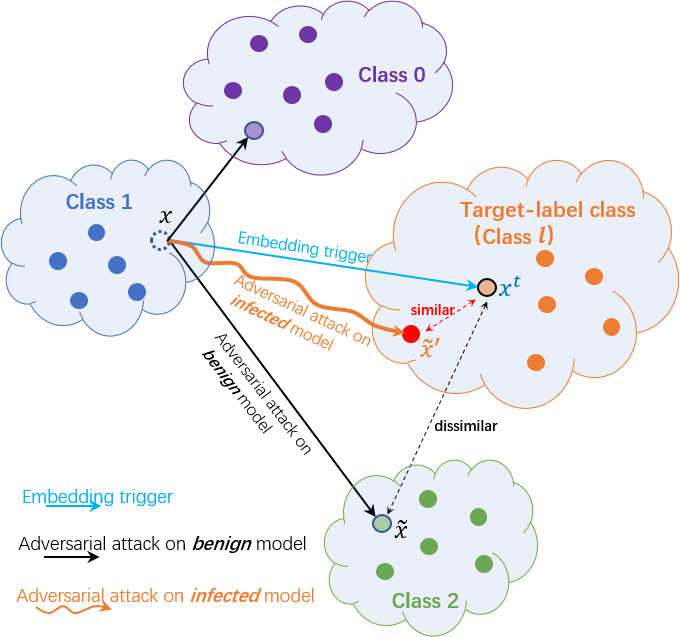

##### Table of contents
1. [Introduction](#Introduction)
2. [Requirements](#Requirements)
3. [Backdoor_Attack](#Backdoor_Attack)
4. [Backdoor_Defense](#Backdoor_Defense)


## Introduction


This paper finds an intriguing connection between backdoor attacks and adversarial attacks: for a model planted with backdoors,
its adversarial examples have similar behaviors as its triggered images. 


Based on these observations, a novel **Progressive Backdoor Erasing (PBE)** algorithm is proposed to
progressively purify the infected model by leveraging untargeted adversarial attacks.

This is an implementation of the CVPR 2023 Paper **[Progressive Backdoor Erasing via connecting Backdoor and Adversarial Attacks](https://arxiv.org/abs/2202.06312)** in Pytorch. This repository includes:
- Training and evaluation code.
- Progressive Backdoor Erasing (PBE) algorithm used in the paper.


## Requirements
- Install required python packages:
```bash
$ python -m pip install -r requirements.py
```

- Download and re-organize GTSRB dataset from its official website:
```bash
$ bash gtsrb_download.sh
```

## Run Backdoor Attack
Poison a small part of training data and train a model, resulting in an infected model.

Run command 
```bash
$ python train_blend.py --dataset <datasetName> --attack_mode <attackMode>
```
where the parameters are the following:
- `<datasetName>`: `mnist` | `cifar10` | `gtsrb` | `celeba`.
- `<attackMode>`: `all2one` (single-target attack) or `all2all` (multi-target attack)`


## Run Backdoor Defense, i.e., erasing the backdoor and producing a purified model.
In this paper, we discuss two defensive settings. (1) The first one follows the setting of the **model repair** defense methods, where we just have an infected model and a clean extra dataset but cannot access the training data. (2) The second one follows the setting of the **data filtering** defense methods, where we can access the training data and do not need to have a clean extra dataset. Note that we do not know which training images are poisoned. 

For the second defensive setting, we propose a **Progressive Backdoor Erasing (PBE)** method, as shown in Algorithm 1. 

Regarding the first defensive setting, we drop the *Initialization* step and use the known *clean* extra dataset. And then, we simply skip the step-3 and only need to run the iteration once, i.e., just run step-1 and step-2 once, which is called **Adversarial Fine-Tuning (AFT)** in this paper.

```bash
$ python aft_main.py --dataset <datasetName> --attack_mode <attackMode> --trigger_type <triggertype> --model_path <modelpath> (with clean data)
$ python pbe_main.py --dataset <datasetName> --attack_mode <attackMode> --trigger_type <triggertype> --model_path <modelpath> (without clean data)
```
where the parameters are the following:
- `<datasetName>`: `mnist` | `cifar10` | `gtsrb` | `celeba`.
- `<attackMode>`: `all2one` (single-target attack) or `all2all` (multi-target attack)`
- `<triggertype>`: `blend` | `patch` | `sig` | `warp`.
- `<modelpath>`: `path of trained model`.


## Contacts

If you have any questions leave a message below with GitHub (log-in is needed).


